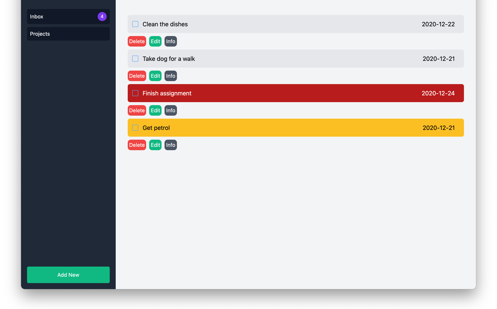
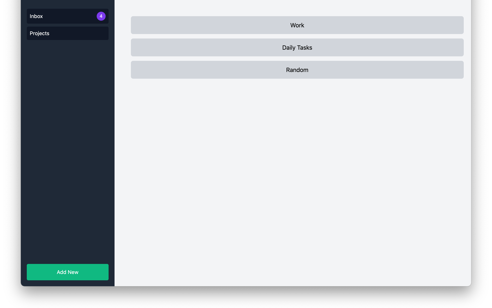
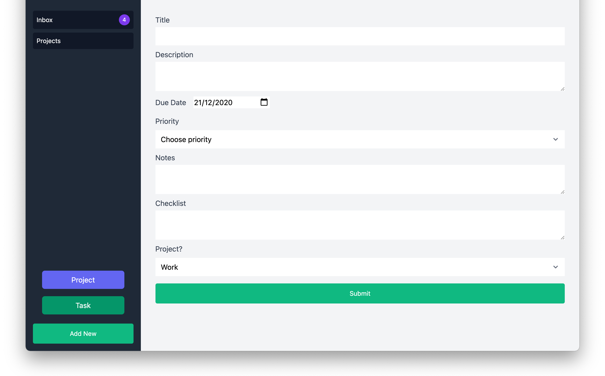

# To-Do List App 📝


## Library Directory 📙

| Contents                  |
| ------------------------- |
| [Built With](#built-with) |
| [Live Demo](#live-demo)   |
| [Install](#install)   |
| [Testing](#testing)   |
| [Authors](#authors)       |
| [License](#license)       |

## Description

> In this project, we created a To-Do app.





This app allows you to create tasks and projects, along with being able to edit a task, delete, assign to a project, set a priority and much more.

## Built With 🛠

```
- JavaScript
- Tailwind CSS
- Webpack
- HTML5
- Netlify
- VS Code
```


## Live Demo 🎥

<a href="https://my-to-do-list-app.netlify.app/"></a>

## Install ⏳

> Follow these steps below to get my Application working. I used [npm](https://www.npmjs.com/) to manage all my packages for JavaScript. If you don't have it installed already, you can install it [here](https://www.npmjs.com/get-npm)

1. - [ ] Open your `Terminal`
2. - [ ] Navigate to the directory where you will like to install the repo by running `cd to-do-list-app`
3. - [ ] Run `git clone git@github.com:DcRonan/to-do-list-app.git` to download <b>or</b> you can download using `HTTPS` by running `git clone https://github.com/DcRonan/to-do-list-app.git` in the terminal
4. - [ ] Run `cd to-do-list-app` to enter the directory
5. - [ ] Run `npm i` to install all the packages
6. - [ ] Run `npm run build` to build the app
7. - [ ] Go on your preferred `browser` and open `dist/index.html` in the folder directory


## Testing ⚙

> I have used linters to test my code, which includes: [webhint](https://webhint.io/), [eslint](https://eslint.org/) and [stylelint](https://stylelint.io/)

1. - [ ] Open `Terminal` again
2. - [ ] Run `cd ADD-REPO-NAME` to enter the directory
3. - [ ] Run `npm test` to start testing
4. - [ ] All tests will pass ✅


## Authors

### 👨‍💻 Daniel Ronan

[](https://github.com/DcRonan) <br>
[](https://www.linkedin.com/in/dan-ronan/) <br>
[](mailto:danielconnorronan@gmail.com) <br>
[](https://twitter.com/dc_ronan)

### 👨‍💻 Meron Ogbai

[](https://github.com/meronokbay) <br>
[](https://linkedin.com/in/meron-ogbai/) <br>
[](mailto:okbaymeron@gmail.com) <br>
[](https://twitter.com/MeronDev)

### 🤝 Contributing

Contributions, issues and feature requests are welcome!

Feel free to check the [issues page](https://github.com/DcRonan/to-do-list-app/issues).

### Show your support

Give a ⭐️ if you like this project!

### License


